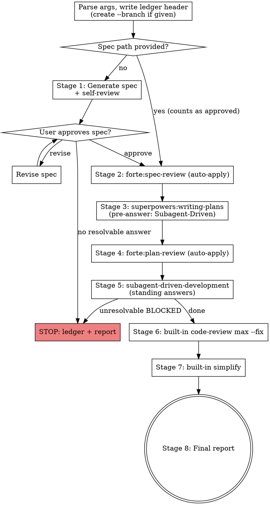

# Autopilot

## Overview

Run the full development pipeline with a single user gate (spec approval). Autopilot is a thin orchestrator: it owns stage ordering, per-stage arguments, gate overrides, and stop conditions. All actual work is delegated to existing skills, so downstream skill improvements flow into the pipeline automatically.

| Stage | Action | Delegated to |
|-------|--------|--------------|
| 1 | Ensure spec (**the only user gate**) | inline |
| 2 | Spec review (auto-fix) | `forte:spec-review` |
| 3 | Implementation plan | `superpowers:writing-plans` |
| 4 | Plan review (auto-fix) | `forte:plan-review` |
| 5 | Implementation | `superpowers:subagent-driven-development` |
| 6 | Code review (auto-fix) | built-in `code-review` |
| 7 | Refactor pass | built-in `simplify` |
| 8 | Final report | inline |

**Why gate overrides work:** the same main-session agent executes both the orchestrator's and the downstream skill's instructions. The pipeline's standing answers (defined per stage below) take precedence over downstream prompts to the user.

**Prerequisites:**
- `forte:spec-review` and `forte:plan-review` (this plugin)
- `superpowers:writing-plans` and `superpowers:subagent-driven-development` (superpowers plugin) — hard requirement; stop if unavailable
- Built-in `code-review` and `simplify` skills — optional; their stages are skipped with a note if unavailable
- `codex` CLI — optional; spec-review / plan-review degrade to Agent-only via their own fallbacks

## When to Use

- You have a feature description and want it taken to implemented, reviewed code without babysitting each stage
- You already have an approved spec — pass its path and the pipeline starts at Stage 2

**When NOT to use:**
- Requirements are fuzzy or exploratory — run `brainstorming` first, then hand autopilot the spec path. Stage 1 is a condensed spec generator, not a substitute for real design exploration.
- You want a single stage only — invoke that skill directly
- Multiple features at once — one pipeline per feature

## Inputs

Receive from skill arguments:
- **Feature description** (free text) — drives Stage 1 spec generation and is passed as context downstream.
- **Spec file path** (optional) — classified by the plan-review rule: a path under a `specs/` directory or matching `*-design.md`. If provided: verify it exists, record it, skip Stage 1's generation AND its user gate (an explicitly provided spec counts as already approved), and start at Stage 2.
- **`--branch <name>`** (optional) — create and switch to the branch at pipeline start (before Stage 1), so the spec, plan, and implementation all land on the same branch. Default: run on the current branch; invoking autopilot without `--branch` constitutes the explicit consent that subagent-driven-development requires for main-branch work.

If neither a feature description nor a spec path is provided, ask via `AskUserQuestion`.

## Pipeline Ledger

Maintain `.superpowers/autopilot/pipeline.md` — pipeline-level, separate from subagent-driven-development's `.superpowers/sdd/progress.md`. Conversation memory does not survive compaction; the ledger does.

- **First write:** ensure the directory is git-ignored — if `git check-ignore .superpowers` fails (non-zero exit), append `.superpowers/` to `.git/info/exclude`. NEVER edit the tracked `.gitignore` without asking.
- **On start:** write a header with the feature description, spec path (once known), flags, and the pipeline start SHA (`git rev-parse HEAD`). The start SHA is the base for Stage 6/7 review ranges and the Stage 8 commit-range report.
- **Before dispatching each stage:** append `Stage N (<name>): started` — a mid-stage compaction must still know which stage was in flight.
- **After each stage completes:** append `Stage N (<name>): complete — <key artifact or commit range>`.
- **When a standing answer defers a decision:** append `DEFERRED: <one-line description>` — Stage 8 assembles its deferred list from these lines.
- **On stop:** append `STOPPED at Stage N: <reason>`.
- **On finish:** after presenting the Stage 8 report, append `PIPELINE COMPLETE` — a finished ledger must never be mistaken for an unfinished run.
- **Resume:** if the ledger exists with unfinished stages, first check identity — resume only if the ledger header's feature/spec matches the current invocation; a `STOPPED` ledger resumes only when the user explicitly re-invokes autopilot for the same feature. For a different feature, archive the old ledger (rename it `pipeline-<date>-<slug>.md`) and start fresh. When resuming, restart at the first stage not marked complete — but validate artifacts before trusting any `complete` line (spec file exists, plan file exists, commit range is non-empty, working tree state matches the next stage). If validation fails, redo that stage.

## Workflow



### Stage 1: Ensure Spec (the only user gate)

- If a spec path was provided: verify it exists, record it in the ledger, and proceed to Stage 2 (no gate).
- Otherwise:
  1. Ask requirement questions in a SINGLE `AskUserQuestion` call (max 4 questions: purpose, constraints, success criteria, scope boundaries). If the user skips a question, proceed with the most reasonable default derivable from the feature description and record the assumption in the spec's Design Decisions table.
  2. Generate the spec at `docs/superpowers/specs/YYYY-MM-DD-<topic>-design.md` with the brainstorming output conventions: Goal, Requirements, Design Decisions (with rationale), Workflow, Error Handling, Deliverables, Out of Scope.
  3. Run the brainstorming-style self-review inline (placeholder scan, internal consistency, scope check, ambiguity check) and fix findings before presenting.
  4. **User gate:** present the spec summary and ask for approval via `AskUserQuestion` (Approve / Revise). On Revise, apply the requested changes and re-ask. This is the only blocking gate in the pipeline.

### Stage 2: Spec Review

Invoke `forte:spec-review` via the Skill tool with args `"<spec-path>"`. Auto-apply is spec-review's default (no flag needed; its finding filter and diff display still run) — do NOT pass `--review-only`. Accept the outcome as-is and proceed. Record the spec path in the ledger completion line.

### Stage 3: Writing Plans

Invoke `superpowers:writing-plans` via the Skill tool with the spec path. **Gate overrides (pipeline-side pre-answers):** do not ask writing-plans' Execution Handoff question ("Which approach?") — the pipeline pre-answers it with Subagent-Driven. Pre-answer its Scope Check too: produce a single plan; if the spec genuinely spans multiple independent subsystems, stop the pipeline and report it — Stage 1 should have caught the decomposition need. Record the plan path (`docs/superpowers/plans/YYYY-MM-DD-<feature>.md`) in the ledger completion line.

### Stage 4: Plan Review

Invoke `forte:plan-review` via the Skill tool with args `"<plan-path> <spec-path>"`. Auto-apply is plan-review's default (no flag needed) — do NOT pass `--review-only`. Report-only findings (coverage gaps, new-task proposals) are recorded as `DEFERRED:` ledger lines for the Stage 8 report, not acted on.

### Stage 5: Implementation

Invoke `superpowers:subagent-driven-development` (SDD) via the Skill tool with the plan path. **Gate override rules — standing answers for ALL of SDD's human-decision points, not just the final review:**

- **Pre-Flight Plan Review conflicts** (SDD's batched question before Task 1) → the plan text governs; record each conflict as a `DEFERRED:` ledger line and proceed. If a conflict makes a task unimplementable as written, stop (Stop Condition 1).
- **Per-task plan-mandated findings** ("ask the human which governs") → same standing answer: plan text governs; record as `DEFERRED:`.
- **Final whole-branch review:** Critical / Important findings → dispatch the fix wave automatically (one fix subagent with the complete findings list, then re-review), as SDD already prescribes. Findings that contradict the plan's text, or that expand scope beyond the spec's deliverables → do NOT auto-apply; record as `DEFERRED:` and continue.
- **Branch consent:** SDD forbids starting implementation on main/master "without explicit user consent" — an autopilot invocation without `--branch` constitutes that consent; note this in the Stage 8 report.
- **Workspace:** work in the current checkout (or the `--branch` branch created at pipeline start) — do NOT invoke `superpowers:using-git-worktrees` or create a worktree, even though SDD lists it as a required workflow skill; a mid-pipeline worktree strands the ledger, spec, plan, and start SHA in the original checkout.
- **Completion handoff:** after SDD's final review, do NOT invoke `superpowers:finishing-a-development-branch` — the pipeline continues to Stage 6; integration options are presented in Stage 8 instead.
- **BLOCKED** from an implementer that survives SDD's own escalation ladder (more context → stronger model → task split) → stop the pipeline (see Stop Conditions).

Record the implementation commit range in the ledger completion line.

### Stage 6: Code Review

Invoke the **built-in** `code-review` skill via the Skill tool with args `"max --fix"` — the one whose registered description reviews "the current diff for correctness bugs and reuse/simplification/efficiency cleanups" and supports `--fix` applying findings to the working tree. Do NOT invoke the `code-review:code-review` plugin command (it reviews GitHub PRs and only posts comments). Scope the review to the pipeline's changes by supplying the recorded start SHA range (`<start-sha>..HEAD`) as context — SDD commits every task, so without a range the "current diff" can be empty. If the built-in skill is unavailable in the session, skip this stage and note it in the Stage 8 report. If the review reports an empty diff (the range was not picked up), record "review saw no diff" in the Stage 8 Notes — do not report it as a clean pass. Commit the result if the skill leaves uncommitted changes:

```bash
git add -A
git commit -m "fix: apply code-review findings"
```

### Stage 7: Simplify

Invoke the **built-in** `simplify` skill via the Skill tool (no args), scoped to the pipeline's start-SHA range like Stage 6. It reviews the changed code for reuse/simplification/efficiency and applies fixes. If the built-in skill is unavailable in the session, skip this stage and note it in the Stage 8 report. Commit if it leaves uncommitted changes:

```bash
git add -A
git commit -m "refactor: apply simplify pass"
```

### Stage 8: Final Report

Present in the terminal (do NOT save the report to disk):

```markdown
## Autopilot Report: {feature}

| Stage | Result | Artifact |
|-------|--------|----------|
| 1 Ensure spec | {done/skipped(provided)} | {spec_path} |
| 2 Spec review | {done — N edits applied} | {spec_path} |
| 3 Plan | {done} | {plan_path} |
| 4 Plan review | {done — N edits applied} | {plan_path} |
| 5 Implementation | {done — N tasks} | {start_sha}..{head_sha} |
| 6 Code review | {done — N findings fixed / skipped: reason} | {commit or "no changes"} |
| 7 Simplify | {done / skipped: reason} | {commit or "no changes"} |

### Deferred decisions (need your judgment)
{one bullet per DEFERRED ledger line; "None" if empty}

### Notes
{branch consent note if run without --branch; codex fallback notes; skipped stages}

### Suggested next actions
{push / create PR / follow-ups — suggestions only; do NOT push unless the user asked}
```

## Stop Conditions

Stop the pipeline — write the `STOPPED` ledger line and present a partial Stage 8 report with resume instructions — when:

1. A stage's skill reports BLOCKED and the pipeline cannot resolve it by adding context, escalating model, or splitting tasks.
2. The Stage 1 user gate is not approved (the user chooses neither Approve nor a resolvable Revise).
3. A destructive operation becomes necessary (force push, history rewrite, deleting user files) — these always require the human.
4. writing-plans' Scope Check determines the spec spans multiple independent subsystems (Stage 3's pre-answer stops rather than splitting into multiple plans).

Explicitly NOT stop conditions: `codex` CLI unavailable (spec-review / plan-review degrade to Agent-only by their own fallbacks); review findings (they are fixed or deferred); a single stage-internal retry.

## Error Handling

| Situation | Action |
|-----------|--------|
| Downstream skill has its own fallback (e.g., codex missing) | Respect it; note in the Stage 8 report. |
| A stage fails outright (tool error, malformed state) | Retry that stage once; if it fails again, stop with ledger + report. |
| Spec/plan path expected but missing at a stage boundary | Stop; report which artifact is missing (likely ledger drift). |
| Built-in `code-review` / `simplify` unavailable | Skip that stage; note in Stage 8 report. |
| superpowers plugin skills unavailable | Stop before Stage 3; the pipeline cannot run without them. |
| Ledger shows an unfinished run on invocation | Check the header matches the current feature/spec first; then resume from the first incomplete stage after validating artifacts. For a different feature, archive the old ledger and start fresh. |

## Quick Reference

| Step | Action |
|------|--------|
| Input | feature description and/or spec path (+ optional `--branch <name>`) |
| Gate | Stage 1 spec approval ONLY; provided spec = pre-approved |
| Ledger | `.superpowers/autopilot/pipeline.md`: header + start SHA, started/complete/DEFERRED/STOPPED/PIPELINE COMPLETE lines |
| Stage args | spec-review `"<spec>"` · writing-plans (pre-answer Subagent-Driven) · plan-review `"<plan> <spec>"` (auto-apply is both reviews' default) · SDD (standing answers) · code-review `"max --fix"` · simplify |
| Deferred | plan-contradicting / scope-expanding / report-only findings → `DEFERRED:` lines → Stage 8 list |
| Output | Stage 8 terminal report; no disk save, no push |

## Common Mistakes

- **Invoking the `code-review:code-review` plugin command in Stage 6** — that reviews GitHub PRs and only posts comments; Stage 6 needs the built-in `code-review` skill with `--fix`.
- **Asking downstream gates the pipeline pre-answers** — writing-plans' Execution Handoff and Scope Check, SDD's pre-flight conflict question, plan-mandated adjudication, workspace/worktree choice, and finishing-a-development-branch are all covered by standing answers. Re-asking them breaks the single-gate contract.
- **Invoking `superpowers:finishing-a-development-branch` after Stage 5** — the pipeline continues to Stage 6; Stage 8 presents integration options.
- **Auto-applying scope-expanding or plan-contradicting findings** — they go to the `DEFERRED:` list, even though the pipeline is "automated".
- **Skipping ledger writes** — the started/complete lines are the only compaction-safe record; write them before AND after every stage dispatch.
- **Forgetting the start SHA** — without it, Stage 6/7 have no diff range and Stage 8 has no commit range.
- **Stopping because codex is missing** — spec-review and plan-review have their own Agent-only fallbacks; respect them and note it in the report.
- **Adding `.superpowers/` to the tracked `.gitignore`** — use `.git/info/exclude`; the tracked file is a user-visible change that needs consent.
- **Re-running Stage 1's gate for a provided spec** — an explicit spec path counts as approved; the pipeline starts at Stage 2.
- **Pushing or creating a PR automatically** — Stage 8 suggests; the user decides.
- **Generating a spec for fuzzy requirements instead of recommending brainstorming** — Stage 1's condensed questions cannot replace design exploration; say so and stop if the feature description is too vague to write concrete requirements.
