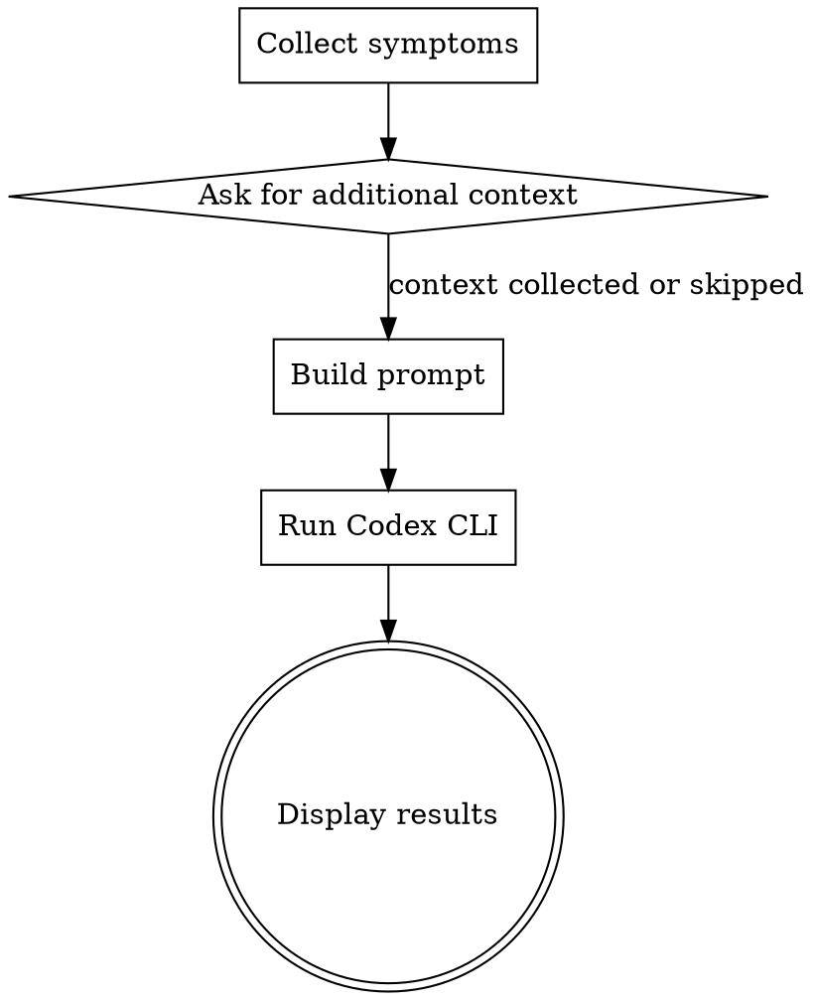

# Codex Investigate

## Overview

Run the OpenAI Codex CLI in read-only mode to investigate the root cause of a bug from its symptoms.
Claude collects the symptom description, sends it to Codex for codebase-wide investigation, and displays the structured findings.

**Prerequisite:** The `codex` CLI must be installed (`npm i -g @openai/codex`).

## When to Use

- When you have a bug symptom but don't know where in the code the problem is
- When you want Codex to read through the codebase and identify the root cause
- When you need a second opinion on what's causing unexpected behavior

**When NOT to use:**
- When you already know the problematic code and want a review (use `codex-review` instead)
- When you want Codex to modify files (this skill is read-only)

## Workflow



### Phase 1: Collect Symptoms

Receive the bug symptom from the user (skill args or AskUserQuestion):
- **Symptom description** (required): Natural language description of the bug (e.g., "Windows background turns black", "mod service fails to start")
- **Additional context** (optional): OS, reproduction steps, error logs, relevant file paths

If the symptom description is too vague (fewer than ~10 characters or extremely generic), ask the user for more specifics before proceeding.

### Phase 2: Build Prompt

Construct the Codex prompt using this template:

```
You are investigating a bug in this codebase.

Symptom:
{symptom_description}

{additional_context_section}

Instructions:
1. Read the relevant source code to understand the area where this bug likely occurs
2. Identify the root cause(s) — explain WHY the bug happens, citing specific file paths and line numbers as evidence
3. Assess the impact scope — what other parts of the codebase are affected
4. Suggest a fix approach — concrete steps to resolve the issue (do NOT modify files)
5. If you cannot determine the root cause with confidence, state what additional information would be needed

Important: You MUST cite specific file paths and line numbers for every claim. Do not speculate without evidence from the code.

Format your response as:
## Root Cause
[Explanation with file:line references as evidence]

## Impact Scope
[What else is affected, with file references]

## Suggested Fix
[Concrete steps to fix]

## Confidence
[High/Medium/Low with reasoning]
- High: Root cause clearly identified with code evidence
- Medium: Likely cause identified but some uncertainty remains
- Low: Multiple possible causes, more investigation needed
```

Where `{additional_context_section}` is omitted if no additional context was provided, or formatted as:

```
Additional Context:
{additional_context}
```

### Phase 3: Run Codex CLI

Write the prompt to a temporary file, then pipe it to Codex via stdin to avoid shell argument length limits:

```bash
# 1. Write prompt to temp file
cat <<'PROMPT_EOF' > /tmp/codex-investigate-prompt.txt
<constructed_prompt>
PROMPT_EOF

# 2. Pipe to Codex via stdin (read-only mode)
cat /tmp/codex-investigate-prompt.txt | codex exec

# 3. Clean up
rm -f /tmp/codex-investigate-prompt.txt
```

- `exec`: Non-interactive subcommand (runs the prompt and exits)
- Codex runs **read-only** — it can read files in the repo but cannot modify them
- Using a temp file avoids shell argument length limits that cause hangs with long prompts

### Phase 4: Display Results

Parse Codex output and display in the terminal. Expected sections:

1. **Root Cause** — Why the bug happens (with file:line references)
2. **Impact Scope** — What else is affected
3. **Suggested Fix** — Concrete steps to resolve
4. **Confidence** — High / Medium / Low with reasoning

If the output does not follow the expected format, display Codex's raw output as-is (fallback).

## Comparison with codex-review

| Aspect | codex-review | codex-investigate |
|--------|-------------|-------------------|
| Purpose | Quality check of known code/design | Root cause analysis of unknown bugs |
| Input | File paths + free text | Symptom description (+ optional context) |
| Output | Issues (Critical/Warning/Info) | Root Cause + Impact + Fix + Confidence |
| Codex directive | List problems | Identify cause and suggest fix |

## Error Handling

- **`codex` not found**: Tell the user to install it with `npm i -g @openai/codex`
- **Non-zero exit code**: Display the error message from Codex
- **Empty output**: Suggest the symptom description may be too vague and ask for more detail

## Common Mistakes

- **Using wrong subcommand**: Must use `codex exec` for non-interactive mode; other invocations may hang
- **Passing long prompts as CLI arguments**: Always use the temp file + stdin approach shown in Phase 3. Passing the prompt directly as a CLI argument (e.g. `codex exec "<prompt>"`) can exceed shell argument length limits (~32KB on Windows) and cause Codex to hang silently
- **Symptom too vague**: Ensure the user provides enough detail for Codex to narrow down the search area
