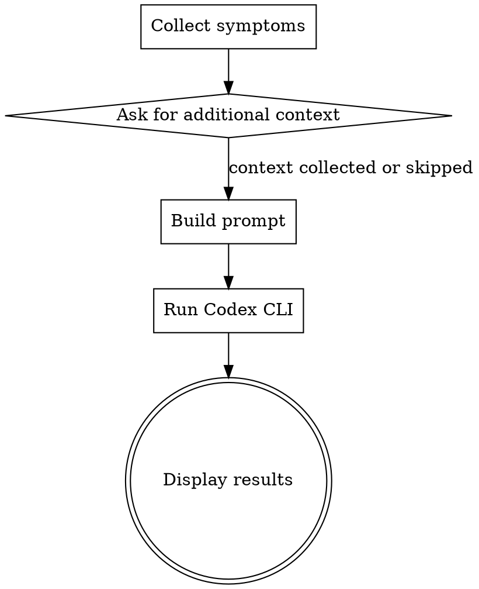

# Codex Investigate

## Overview

Run the OpenAI Codex CLI in read-only mode to investigate the root cause of a bug from its symptoms.
Claude collects the symptom description, sends it to Codex for codebase-wide investigation, and displays the structured findings.

**Prerequisite:** The `codex` CLI must be installed (`npm i -g @openai/codex`).

**Shared contract:** Codex invocation mechanics live in codex-engine REFERENCE.md. Before Phase 3:

1. Use `Glob pattern="**/codex-engine/REFERENCE.md"` to locate the file
2. Read it

If not found, display: `> Warning: codex-engine reference not found. Using inline rules only.`

## When to Use

- When you have a bug symptom but don't know where in the code the problem is
- When you want Codex to read through the codebase and identify the root cause
- When you need a second opinion on what's causing unexpected behavior

**When NOT to use:**
- When you already know the problematic code and want a review (use the built-in `code-review` skill instead)
- When you want Codex to modify files (this skill is read-only)

## Workflow


```dot
digraph codex_investigate {
    rankdir=TB;
    "Collect symptoms" [shape=box];
    "Ask for additional context" [shape=diamond];
    "Build prompt" [shape=box];
    "Run Codex CLI" [shape=box];
    "Display results" [shape=doublecircle];

    "Collect symptoms" -> "Ask for additional context";
    "Ask for additional context" -> "Build prompt" [label="context collected or skipped"];
    "Build prompt" -> "Run Codex CLI";
    "Run Codex CLI" -> "Display results";
}
```

### Phase 1: Collect Symptoms

Receive the bug symptom from the user (skill args or AskUserQuestion):
- **Symptom description** (required): Natural language description of the bug (e.g., "Windows background turns black", "mod service fails to start")
- **Additional context** (optional): OS, reproduction steps, error logs, relevant file paths

If the symptom description is too vague (fewer than ~10 characters or extremely generic), ask the user for more specifics before proceeding.

### Phase 2: Build Prompt

Construct the Codex prompt using this template:

```
You are investigating a bug in this codebase.

Symptom:
{symptom_description}

{additional_context_section}

Instructions:
1. Read the relevant source code to understand the area where this bug likely occurs
2. Identify the root cause(s) — explain WHY the bug happens, citing specific file paths and line numbers as evidence
3. Assess the impact scope — what other parts of the codebase are affected
4. Suggest a fix approach — concrete steps to resolve the issue (do NOT modify files)
5. If you cannot determine the root cause with confidence, state what additional information would be needed

Important:
- You MUST cite specific file paths and line numbers for every claim. Do not speculate without evidence from the code.
- Label each piece of evidence as [code-verified] (found in specific file:line) or [general-knowledge] (based on known behavior of frameworks/libraries). Prioritize [code-verified] evidence.
- Be concise. If a section has no findings, write "N/A" and move on — do not pad with filler content.

Format your response as:
## Root Cause
[Explanation with file:line references as evidence. Label each reference: [code-verified] or [general-knowledge]]

## Impact Scope
[What else is affected, with file references. Label each reference: [code-verified] or [general-knowledge]]

## Suggested Fix
[Concrete steps to fix]

## Confidence
[High/Medium/Low with reasoning]
- High: Root cause clearly identified with code evidence
- Medium: Likely cause identified but some uncertainty remains
- Low: Multiple possible causes, more investigation needed
```

Where `{additional_context_section}` is omitted if no additional context was provided, or formatted as:

```
Additional Context:
{additional_context}
```

### Phase 3: Run Codex CLI

Before running Codex, display a brief status message to the user:

> "Running Codex investigation — this typically takes 30-90 seconds..."

Run the canonical invocation from codex-engine REFERENCE.md with:

| Value | |
|-------|---|
| `{PREFIX}` | `codex-investigate` |
| `{prompt}` | The prompt constructed in Phase 2 |

Then follow the reference's wait protocol (Monitor until-loop on `CODEX_DONE_MARKER`, 900s
ceiling) and read-back protocol. `CODEX_FINAL_OUTPUT` is the sole source for Phase 4.

### Phase 4: Display Results

Read the `CODEX_FINAL_OUTPUT` file completely, then parse and display it in the terminal. Expected sections:

1. **Root Cause** — Why the bug happens (with file:line references)
2. **Impact Scope** — What else is affected
3. **Suggested Fix** — Concrete steps to resolve
4. **Confidence** — High / Medium / Low with reasoning

If the output does not follow the expected format, display Codex's raw final message as-is (fallback). Remove the temporary final-message file after parsing or fallback display is complete.

## Error Handling

- **`codex` not found**: Tell the user to install it with `npm i -g @openai/codex`
- **Non-zero exit code**: Display the error message from Codex
- **Empty output**: Suggest the symptom description may be too vague and ask for more detail

## Common Mistakes

Invocation-level mistakes (wrong subcommand, CLI-argument prompts, truncated final message,
model/effort flags) are covered in codex-engine REFERENCE.md. Skill-specific:

- **Symptom too vague**: Ensure the user provides enough detail for Codex to narrow down the search area
- **Parsing a partial response**: If the four expected sections are missing, fall back to displaying the raw final message rather than inventing structure
