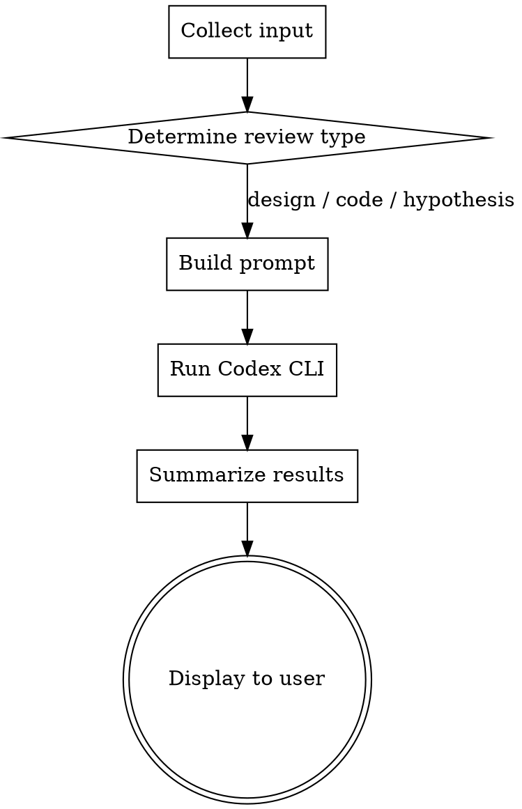

# Codex Review

## Overview

Run the OpenAI Codex CLI in read-only mode to investigate bugs and improvements in designs, code, and hypotheses.
Claude organizes and displays Codex's output in the terminal.

**Prerequisite:** The `codex` CLI must be installed (`npm i -g @openai/codex`).

## When to Use

- When you want to find contradictions, ambiguities, or gaps in design documents
- When you want a second perspective on code bugs, edge cases, or security issues
- When you want to verify the validity of a hypothesis or assumptions
- When you want a second opinion

**When NOT to use:**
- When you want Codex to modify files (this skill is read-only)
- When you just need a simple question answered or an explanation

## Workflow



### Phase 1: Collect Input

Receive review target from user (skill args or AskUserQuestion):
- **File paths** (one or more)
- **Free text** (hypothesis, design summary, etc.)
- Or both

### Phase 2: Build Prompt

Select prompt template based on review type:

**Design Review:**
```
Analyze the following design document. Identify issues from these perspectives:
- Contradictions or logical inconsistencies
- Ambiguous descriptions or insufficient definitions
- Missing considerations
- Feasibility concerns
Files: {paths}
{free_text}
```

**Code Review:**
```
Analyze the following code. Identify issues from these perspectives:
- Bugs or logic errors
- Unhandled edge cases
- Security issues
- Performance concerns
- Deviation from design (if design information is available)
Files: {paths}
{free_text}
```

**Hypothesis Verification:**
```
Verify the following hypothesis. Analyze from these perspectives:
- Validity of assumptions
- Counterexamples or counterarguments
- Overlooked factors
- Possible alternative hypotheses
{free_text}
Reference files: {paths}
```

**Note:** File contents can be inlined in the prompt via temp file + stdin. However, prefer inlining only relevant excerpts (specific functions or sections) rather than entire files — shorter context produces faster, more focused results.

### Phase 3: Run Codex CLI

Before running Codex, display a brief status message to the user:

> "Running Codex review — this typically takes 30-90 seconds..."

**For Code Review (preferred path):** Use the dedicated `codex exec review` subcommand which scopes context to diffs automatically:

```bash
# For uncommitted changes:
codex exec review --uncommitted --ephemeral -m gpt-5.4-mini

# For changes against a base branch:
codex exec review --base main --ephemeral -m gpt-5.4-mini

# With custom review instructions (from prompt):
cat /tmp/codex-review-prompt.txt | codex exec review --uncommitted --ephemeral -m gpt-5.4-mini
```

**For Design Review and Hypothesis Verification** (no diff-scoping applicable): Use generic `codex exec` with optimization flags:

```bash
# 1. Write prompt to temp file
cat <<'PROMPT_EOF' > /tmp/codex-review-prompt.txt
<constructed_prompt>
PROMPT_EOF

# 2. Pipe to Codex via stdin
cat /tmp/codex-review-prompt.txt | codex exec --ephemeral -m gpt-5.4-mini

# 3. Clean up
rm -f /tmp/codex-review-prompt.txt
```

- `exec review`: Purpose-built subcommand that scopes context to relevant diffs, reducing context size and latency
- `--ephemeral`: Skip session persistence (skills never resume sessions)
- `-m gpt-5.4-mini`: Use a faster model optimized for speed (override with `-m gpt-5.4` if deeper reasoning is needed)
- Set Bash tool `timeout: 180000` (3 minutes) to prevent the default 120s timeout from killing longer runs

**Important:** Codex runs read-only. It can read files in the repo but cannot modify them.

### Phase 4: Summarize Results

Parse Codex output and organize into:

1. **Issues Found** — with severity (Critical / Warning / Info)
2. **Improvement Suggestions**
3. **Positive Points** (if any)

Display organized results in the terminal.

## Quick Reference

| Input Type | Prompt Template | Key Focus |
|-----------|----------------|-----------|
| Design doc | Design Review | Contradictions, gaps, feasibility |
| Code files | Code Review | Bugs, edge cases, security |
| Hypothesis | Hypothesis Verification | Assumptions, counterexamples |
| Mixed | Combine templates | All applicable perspectives |

## Common Mistakes

- **Using wrong subcommand**: Must use `codex exec` for non-interactive mode; other invocations may hang
- **Passing long prompts as CLI arguments**: Always use the temp file + stdin approach shown in Phase 3. Passing the prompt directly as a CLI argument (e.g. `codex exec "<prompt>"`) can exceed shell argument length limits (~32KB on Windows) and cause Codex to hang silently
- **Overly broad scope**: Review specific files/sections, not the entire repo
- **Ignoring Codex errors**: If `codex` is not installed, inform the user to install it
