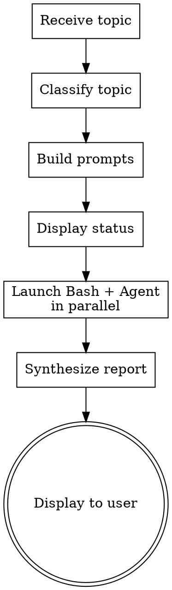

# Parallel Research

## Overview

Dispatch parallel investigations to Codex CLI (codebase-focused) and a Claude Code Agent (codebase + web), then synthesize a unified report in the terminal. Two AI perspectives on the same topic, combined into one coherent answer.

**Prerequisite:** The `codex` CLI must be installed (`npm i -g @openai/codex`). If unavailable, fall back to Claude Code Agent results only.

## When to Use

- When you want multiple AI perspectives on a technical question, design decision, or bug
- When you want both codebase analysis (Codex) and broader research (Claude Code Agent + Web)
- When a single investigation might miss something

**When NOT to use:**
- Simple questions or explanations that don't need parallel investigation
- File modification tasks (this skill is read-only)
- Deep multi-round debates (use investigation-board or discussion-board instead)

## Workflow



### Phase 1: Receive Topic

Receive the topic from the user via skill arguments. The topic is free-form text describing what to investigate.

If no topic is provided in the arguments, ask the user with AskUserQuestion:
> "What topic would you like me to investigate with parallel research?"

### Phase 2: Classify Topic

Classify the topic into one of three categories to determine prompt strategy:

| Category | Criteria | Codex Instructions | Claude Code Agent Instructions |
|----------|----------|-------------------|-------------------------------|
| **Code** | Mentions specific files, functions, bugs, or implementation details | Investigate the codebase | Investigate the codebase (different perspective) |
| **Knowledge** | General technical concepts, design patterns, best practices | Search codebase for related implementations | Web search + codebase investigation |
| **Mixed** | Contains elements of both | Investigate the codebase | Web search + codebase investigation |

When uncertain, default to **Mixed**.

### Phase 3: Build Prompts

Build separate prompts for Codex and Claude Code Agent.

**Shared output format (include in both prompts):**
```
Report your findings in this structure:
- Summary (3-5 sentences)
- Detailed findings (bullet points)
- Sources (file paths, URLs, etc.)
- Confidence: High / Medium / Low with reasoning
```

**Codex prompt template:**
```
## Research Topic
{user_topic}

## Instructions
Investigate this topic by reading the codebase. {category_specific_codex_instructions}

Cite specific file paths and line numbers as evidence.
Be concise — if a section has no findings, write "N/A".

## Output Format
{shared_output_format}
```

**Category-specific Codex instructions:**
- **Code:** "Focus on the specific files and functions mentioned. Trace the execution flow, identify related code, and analyze the behavior."
- **Knowledge:** "Search the codebase for implementations related to this concept. Identify patterns, usage examples, and any deviations from standard practices."
- **Mixed:** "Investigate both the specific code mentioned and broader patterns in the codebase related to this topic."

**Claude Code Agent prompt template:**
```
## Research Topic
{user_topic}

## Instructions
Investigate this topic thoroughly. {category_specific_agent_instructions}

Report only what you find with evidence. Do not speculate.

## Output Format
{shared_output_format}
```

**Category-specific Agent instructions:**
- **Code:** "Use Read, Grep, and Glob to investigate the codebase from a different angle than a pure code search. Look for architectural context, related tests, documentation, and usage patterns."
- **Knowledge:** "Use WebSearch and WebFetch to research this topic online (documentation, Stack Overflow, blog posts, RFCs). Also check the codebase with Read/Grep/Glob for related implementations."
- **Mixed:** "Combine codebase investigation (Read/Grep/Glob) with web research (WebSearch/WebFetch) to build a complete picture."

### Phase 4: Launch Parallel

Display a status message, then launch both investigations in a **single message** with two tool calls:

**Status message (display before tool calls):**
> "Codex と Claude Code Agent に並列で調査を依頼しています..."

**Tool call 1 — Bash (Codex):**
```bash
TMPFILE=$(mktemp /tmp/parallel-research-codex-XXXXXX.txt)
trap 'rm -f "$TMPFILE"' EXIT
cat <<'PROMPT_EOF' > "$TMPFILE"
{codex_prompt}
PROMPT_EOF
# --ephemeral: skip session persistence (skills never resume sessions)
cat "$TMPFILE" | codex exec --ephemeral -m gpt-5.3-codex
```
- Set Bash tool `timeout: 180000` (3 minutes)

**Tool call 2 — Agent:**
```json
{
  "description": "parallel-research Claude investigation",
  "prompt": "{agent_prompt}"
}
```
- Uses general-purpose agent (default subagent_type)
- Agent has access to Read, Grep, Glob, WebSearch, WebFetch

**Both tool calls MUST be in the same message for true parallel execution.**

**Codex unavailable fallback:** If `codex` command is not found (exit code 127 or "command not found" in stderr), proceed with Claude Code Agent results only. Note this in the report.

### Phase 5: Synthesize Report

After both results return (or one result + one error), synthesize into this format and display in the terminal:

```markdown
## Parallel Research Report: {topic}

### Overall Conclusion
{Integrated conclusion drawing from both investigations}

### Agreement
{Points where both Codex and Claude Code Agent reached the same conclusion}

### Differences & Complementary Findings
{Points found by only one side, or where perspectives differ}

### Codex Findings
{Summary of Codex investigation results}

### Claude Code Findings
{Summary of Claude Code Agent investigation results}

### Confidence
{Overall confidence level with reasoning}
```

**Confidence rubric:**

| Level | Criteria |
|-------|----------|
| **High** | Both agree and provide concrete evidence (file paths, URLs) |
| **Medium** | Mostly agree with minor differences, or evidence is limited |
| **Low** | Significant disagreement, weak evidence, or only one source available |

**Fallback cases:**
- If only one side returned results, still use this format but note the missing source and set confidence to Low
- If one side's output doesn't match the expected structure, include whatever was returned under the appropriate section and note it was unstructured
- If both fail, report the error to the user and stop

## Error Handling

| Situation | Action |
|-----------|--------|
| Codex CLI not installed or timeout | Report with Claude Code Agent results only. Add note: "⚠ Codex未使用: {reason}" at report top |
| Agent failure | Report with Codex results only. Add note: "⚠ Claude Code Agent未使用: {reason}" at report top |
| Both fail | Display error message and stop |
| Partial/malformed output from either side | Best-effort integration, note which side was incomplete |

## Common Mistakes

- **Not launching both tools in the same message**: Codex Bash call and Agent call MUST be in a single message for parallel execution. Sequential calls defeat the purpose of this skill.
- **Using wrong Codex subcommand**: Must use `codex exec` for non-interactive mode; other invocations may hang.
- **Passing long prompts as CLI arguments**: Always use the temp file + stdin approach. Direct CLI arguments can exceed shell limits and cause Codex to hang silently.
- **Forgetting timeout**: Set Bash tool `timeout: 180000` (3 minutes) for the Codex call.
