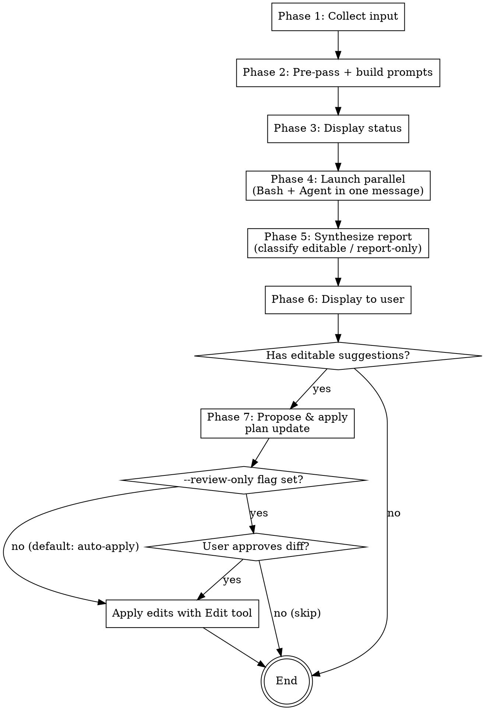

# Plan Review

## Overview

Dispatch parallel reviews of an implementation plan to Codex CLI (codebase-grounded) and a Claude Code Agent (codebase + web), synthesize a 4-axis report in the terminal, then optionally apply updates back to the plan file. This is the Plan-file counterpart of `spec-review`: two AI perspectives on the same plan, combined into one coherent review with a single review-to-revision loop.

It is a gate between plan writing and plan execution:

```
brainstorming → spec-review → writing-plans → plan-review → executing-plans / subagent-driven-development
```

By default, plan updates are auto-applied: the proposed diff is displayed, then the edits are written to the plan file without an approval prompt. Pass the **`--review-only`** flag in the skill arguments to restore the approval gate (Apply/Skip) before any edit. The legacy **`--fix`** flag is accepted as a deprecated no-op (auto-apply is now the default).

**Prerequisite:** The `codex` CLI must be installed (`npm i -g @openai/codex`). If unavailable, fall back to Claude Code Agent results only.

> **Maintenance note:** plan-review intentionally clones spec-review's Phases 3–7 mechanics. Any future fix to spec-review's parallel-launch, synthesis rubric, or Phase 7 semantics must be mirrored here (and vice versa). If the two drift repeatedly, extract a shared `review-engine` reference (the board-engine pattern) at that point — not now (YAGNI).

## When to Use

- After `writing-plans` produces a plan and before `executing-plans` / `subagent-driven-development`, to get a second opinion
- When auditing an existing plan for incorrect code, wrong API usage, better approaches, simplification opportunities, or structural defects

**When NOT to use:**
- For a spec / design document — use `spec-review` instead
- For implementation code review — use `code-review-board` or `codex-review` instead
- To generate missing tasks — adding tasks is `writing-plans`' responsibility; this skill reports coverage gaps but never creates tasks

## The 4 Fixed Axes (Plan Edition)

Every review evaluates the plan along these four axes:

| # | Axis | Focus |
|---|------|-------|
| 1 | **Technical Correctness** | Does the concrete code / API usage / file paths / commands in plan steps match the actual codebase? Detect nonexistent APIs, wrong signatures, wrong paths, commands that cannot succeed. |
| 2 | **Approach Improvement** | Is there a technically better approach for a task's implementation (algorithm, library, language feature)? |
| 3 | **Simplification** | Can tasks, code, or abstractions be reduced (YAGNI)? Mergeable tasks, unnecessary layers, over-engineered steps. |
| 4 | **Plan Integrity** | Plan-specific structural checks: task Interfaces (Consumes/Produces) consistency in names and types across tasks — checked only when the plan contains Interfaces blocks (older plans predate them; absence is reported as "not present", not a defect) — task dependency ordering, placeholder violations (TBD / "similar to Task N" / missing code blocks), and — when a spec is available — spec requirement coverage gaps. |

Both Codex and the Claude Code Agent evaluate ALL four axes. Their evidence-gathering methods differ:
- **Codex**: reads the codebase to ground claims (`[code-verified]`)
- **Claude Code Agent**: uses Read/Grep/Glob + WebSearch/WebFetch (`[web-verified]`, `[code-verified]`)

Both may also tag findings as `[general-knowledge]` (technical knowledge without concrete evidence) or `[unverified]` (claim that could not be confirmed; state what evidence would be needed).

## Workflow



### Phase 1: Collect Input

Receive from skill arguments:
- **`--review-only` flag** (optional) — if present anywhere in the arguments, restore the approval gate in Phase 7. Record `review_only = true`; otherwise `review_only = false` (auto-apply is the default). The legacy `--fix` token may also appear — accept it as a deprecated no-op. Strip both `--review-only` and `--fix` tokens from the arguments before parsing paths / free text.
- **Plan file path(s)** (required) — one or more implementation plan files.
- **Spec file path** (optional) — the source spec, enables the coverage check in Axis 4.
- **Free text** (optional additional context).

**Path classification:** a provided path located under a `specs/` directory or whose filename ends in `-design.md` is treated as the spec; any other existing path is a plan file. If classification is ambiguous, ask the user via `AskUserQuestion`.

If no plan path remains after stripping the flags, ask the user with `AskUserQuestion`:
> "Please provide the path(s) to the plan file(s) to review (one or more)."

**Spec auto-discovery (when no spec path was given):**
1. Scan the plan file itself for an explicit spec path or link; use it if the file exists.
2. Otherwise match slugs against `docs/superpowers/specs/`, normalizing both sides by stripping the `YYYY-MM-DD-` date prefix and a trailing `-design` suffix (plans and specs carry different dates).

Use a match only if it is unambiguous, and state in the report which spec was used. Never guess among multiple candidates; if none is found, run the review without the coverage check and note this in the report.

Verify each provided path exists. If a path is missing, report the error and stop.

### Phase 2: Pre-pass + Build Prompts

**Deterministic pre-pass (Grep, before prompt building):** collect two candidate lists from the plan file(s):

1. Placeholder red-flag hits — lines matching `TBD` or `TODO` (case-sensitive) and `Similar to Task` or `implement later` (case-insensitive), with line numbers.
2. All Interfaces lines — lines matching `Interfaces`, `Consumes`, or `Produces` (with line numbers).

Inject both lists into BOTH reviewer prompts under a `## Verification Candidates` section (write "none found" for an empty list). Reviewers adjudicate false positives (e.g., a legitimate mention of "TODO" inside example code the plan intentionally shows) and do the semantic checks the grep cannot (type consistency, ordering).

Build separate prompts for Codex and the Claude Code Agent. Both use the same 4-axis structure and the same output format. Only the evidence-gathering instructions differ.

**Shared output format (include in both prompts):**

```
Report your findings using EXACTLY this structure. If an axis has no findings, write "N/A".

## 1. Technical Correctness
- Finding: <issue or confirmation>
- Evidence: [code-verified|web-verified|general-knowledge|unverified] <citation>
(repeat per finding)

## 2. Approach Improvement
- Suggestion: <proposed change>
- Rationale: <why>
- Trade-off: <what is lost>
(repeat per suggestion)

## 3. Simplification
- Suggestion: <proposed change>
- Rationale: <why>
- Trade-off: <what is lost>
(repeat per suggestion)

## 4. Plan Integrity
- Finding: <structural defect or confirmation>
- Category: interfaces | ordering | placeholder | coverage
- Evidence: [code-verified|web-verified|general-knowledge|unverified] <citation>
(repeat per finding)

## Confidence
High / Medium / Low — <reasoning>
```

**Codex prompt template:**

```
## Plan Files
{plan_paths_one_per_line}

## Spec File (for coverage check)
{spec_path or "None — skip the coverage check"}

## Verification Candidates
### Placeholder red-flag lines (from grep)
{placeholder_hits or "none found"}
### Interfaces lines (from grep)
{interfaces_lines or "none found"}

## Additional Context
{free_text or "N/A"}

## Instructions
You are reviewing the implementation plan(s) listed above. READ the files yourself (do not rely on inlined excerpts). The plan contains inline code snippets and file references like `Modify: path:123-145`. Verify snippets against the actual referenced files.

Evaluate the plan along these 4 fixed axes:
1. Technical Correctness — verify the concrete code, API usage, file paths, and commands in plan steps against the actual codebase. Open every file referenced by Create/Modify/Test entries. Flag nonexistent APIs, wrong signatures, wrong paths, and commands that cannot succeed.
2. Approach Improvement — propose technically better approaches (algorithm, library, language feature) for a task's implementation when applicable.
3. Simplification — propose ways to reduce tasks, code, or abstractions while preserving intent (YAGNI). Look for mergeable tasks, unnecessary layers, over-engineered steps.
4. Plan Integrity — structural checks: (a) Interfaces (Consumes/Produces) consistency in names and types across tasks — ONLY if the plan contains Interfaces blocks; if absent, report "not present", not a defect; (b) task dependency ordering (a task consuming something defined in a later task is a defect); (c) placeholder violations — adjudicate the grep candidates above and scan for steps that change code without showing the code; (d) spec requirement coverage — ONLY if a spec file is listed above: report spec requirements with no corresponding task.

Evidence requirements:
- For each finding, cite the plan location (task number + step number, or quoted text) AND the supporting evidence (file:line for codebase, or label "[general-knowledge]" if no concrete evidence).
- Do NOT speculate. If a claim cannot be verified, mark the finding as [unverified] and state what evidence would be needed.

## Output Format
{shared_output_format}
```

**Claude Code Agent prompt template:**

```
## Plan Files
{plan_paths_one_per_line}

## Spec File (for coverage check)
{spec_path or "None — skip the coverage check"}

## Verification Candidates
### Placeholder red-flag lines (from grep)
{placeholder_hits or "none found"}
### Interfaces lines (from grep)
{interfaces_lines or "none found"}

## Additional Context
{free_text or "N/A"}

## Instructions
You are reviewing the implementation plan(s) listed above. Use Read to load the plan file(s). The plan contains inline code snippets and file references like `Modify: path:123-145`. Verify snippets against the actual referenced files via Read/Grep/Glob.

Evaluate the plan along these 4 fixed axes:
1. Technical Correctness — verify the concrete code, API usage, file paths, and commands in plan steps. Open every file referenced by Create/Modify/Test entries. Use WebSearch/WebFetch to check current behavior of libraries/APIs/CLI tools the plan relies on, especially recent features or third-party services.
2. Approach Improvement — propose technically better approaches (algorithm, library, language feature). Use Web for state-of-the-art references when applicable.
3. Simplification — propose ways to reduce tasks, code, or abstractions (YAGNI). Look for related implementations in the codebase via Read/Grep/Glob.
4. Plan Integrity — structural checks: (a) Interfaces (Consumes/Produces) consistency in names and types across tasks — ONLY if the plan contains Interfaces blocks; if absent, report "not present", not a defect; (b) task dependency ordering (a task consuming something defined in a later task is a defect); (c) placeholder violations — adjudicate the grep candidates above and scan for steps that change code without showing the code; (d) spec requirement coverage — ONLY if a spec file is listed above: report spec requirements with no corresponding task.

Evidence requirements:
- For each finding, cite the plan location (task number + step number, or quoted text) AND the supporting evidence:
  - Codebase: file:line — tag [code-verified]
  - Web: URL — tag [web-verified]
  - Pure technical knowledge: tag [general-knowledge]
- Do NOT speculate. If a claim cannot be verified, mark [unverified].

## Output Format
{shared_output_format}
```

### Phase 3: Display Status

Before launching the parallel calls, display:

> "Requesting a parallel plan review from Codex and the Claude Code Agent (1–4 minutes; plan reviews open every referenced file)..."

### Phase 4: Launch Parallel

Launch both tools in **a single message with two tool calls**. Sequential calls defeat the purpose of this skill.

**Tool call 1 — Bash (Codex):**

```bash
TMPFILE=$(mktemp /tmp/plan-review-codex-XXXXXX)
OUTFILE=$(mktemp /tmp/plan-review-codex-out-XXXXXX)
trap 'rm -f "$TMPFILE" "$OUTFILE"' EXIT
cat <<'PROMPT_EOF' > "$TMPFILE"
{codex_prompt}
PROMPT_EOF
# --ephemeral: skip session persistence (skills never resume sessions)
# -s read-only: the reviewer must never write, regardless of user config
# -o: write only the final message to OUTFILE (no event/progress noise)
cat "$TMPFILE" | codex exec --ephemeral -s read-only -o "$OUTFILE"
echo "===== FINAL MESSAGE ====="
cat "$OUTFILE"
```

- Set Bash tool `timeout: 300000` (5 minutes). This is deliberately higher than spec-review's 180s: Axis 1 requires opening every file referenced by `Modify: path:line` entries, so plan reviews fan out wider than spec reviews.
- Never pass the prompt as a CLI argument — temp file + stdin only.
- Use the text after `===== FINAL MESSAGE =====` for synthesis; ignore the event log above it.

**Tool call 2 — Agent (Claude Code):**

```json
{
  "description": "plan-review Claude Code investigation",
  "subagent_type": "general-purpose",
  "prompt": "{agent_prompt}"
}
```

- The general-purpose agent has Read, Grep, Glob, WebSearch, WebFetch access.

**Both tool calls MUST be in the same message.**

**Codex unavailable fallback:** If `codex` returns exit 127, stderr contains "command not found", or the Bash call times out, proceed with Claude Code Agent results only. Note this at the top of the final report. (See Error Handling table for the full failure matrix.)

### Phase 5: Synthesize Report

After both results return (or one result + one error), build the unified report. Synthesize **per axis** — for each of the 4 axes, integrate both perspectives, then call out agreement / differences.

During synthesis, classify every finding as **editable** (a concrete text change to the plan) or **report-only**. The following are ALWAYS report-only:
- Coverage gaps ("spec requirement X has no corresponding task") and any new-task proposal — adding tasks is `writing-plans`' responsibility
- Unresolved disagreements between Codex and the Claude Code Agent
- Vague concerns without a specific text change

Only editable findings enter the Phase 7 filter.

```markdown
## Plan Review Report: {plan_path}

{if Codex unavailable: "⚠ Codex not used: {reason}"}
{if Agent unavailable: "⚠ Claude Code Agent not used: {reason}"}
{if spec auto-discovered: "Spec used for coverage check: {spec_path} (auto-discovered)"}
{if no spec: "No spec available — coverage check skipped"}

### Overall Assessment
{3-5 sentences: is the plan technically sound and executable? Major concerns?}

### 1. Technical Correctness
**Findings:**
- {finding} — Codex: {evidence}; Claude Code: {evidence}
{repeat per finding}

**Agreement:** {points where both reached the same conclusion}
**Differences:** {points found by only one side, or where perspectives differ}

### 2. Approach Improvement
{same structure}

### 3. Simplification
{same structure}

### 4. Plan Integrity
{same structure, with each finding's category: interfaces | ordering | placeholder | coverage}

### Report-Only Findings (not applied)
- {finding} — {why it is report-only}

### Confidence: High / Medium / Low
{reasoning based on agreement level and evidence strength}

---

Review the report, then decide whether to approve the plan updates proposed in Phase 7. After approval, proceeding to `executing-plans` or `subagent-driven-development` is recommended.
```

**Confidence rubric:**

| Level | Criteria |
|-------|----------|
| **High** | Both sides agree on major points and provide concrete evidence ([code-verified] / [web-verified]) |
| **Medium** | Mostly agree with minor differences, or some evidence is [general-knowledge] |
| **Low** | Significant disagreement, weak evidence, or only one source available |

**Fallback cases:**
- If only one side returned results, still use the format above; note the missing source and set confidence to Low.
- If one side's output does not match the expected structure, include whatever was returned under the appropriate axis and note it was unstructured.
- If both fail, report the error to the user and stop.

### Phase 6: Display to User

Display the synthesized report in the terminal. Do NOT save the report to disk. (Plan file edits, if any, happen in Phase 7.) Proceed to Phase 7.

### Phase 7: Propose & Apply Plan Update

After the report is displayed, optionally apply the review's editable findings back to the plan file as edits.

- **Default mode** (`review_only = false`): the diff is built and displayed (Steps 7.1–7.2), then the approval gate (Step 7.3) is skipped and the edits are applied automatically (Step 7.4).
- **Review-only mode** (`review_only = true`, i.e. `--review-only` was passed): edits are proposed and applied only after the user approves the diff (Step 7.3).

The skip conditions and the finding filter (Step 7.1) apply in BOTH modes — auto-apply only removes the human approval gate, it does not loosen which findings qualify as edits.

#### Skip conditions

Skip Phase 7 entirely (proceed to End) if any of the following holds:

- **No editable suggestions** — after filtering (below), zero proposed edits remain. Tell the user: "No applicable concrete suggestions, so Phase 7 is skipped."
- **Multiple plan files** — if more than one plan path was provided, ask the user via `AskUserQuestion` which file to update, or skip if none. The "Task N > Step M" edit targeting assumes a single plan.

#### Step 7.1: Filter findings into actionable edits

Walk through each **editable** finding from the synthesized report (report-only findings never reach this step). Keep a finding ONLY if all three hold:

1. **Concrete change** — the finding/suggestion describes a specific text change (not a vague concern like "consider performance").
2. **Locatable** — the target is identifiable as "Task N > Step M" plus quoted text, or — for edits in non-task sections (Goal, Architecture, Tech Stack, Global Constraints) — a unique section heading plus quoted text. Plan steps are bold list items, not headings, so heading paths alone are not unique; quoted text is the anchor.
3. **Confidence is not Low** — only High / Medium findings are proposed by default. Low-confidence items may be presented separately if the user opts in.

Discard everything else. Findings that disagreed between Codex and the Claude Code Agent are kept ONLY when the disagreement was resolved during synthesis; unresolved conflicts are NOT proposed as edits.

#### Step 7.2: Build the proposed diff

For each kept finding, construct an edit entry:

````
### Edit {N} — {axis} — {short title}
**Location:** Task {N} > Step {M} — "{quoted anchor text}" (or, for non-task sections: {section heading} — "{quoted anchor text}")
**Operation:** replace | insert-after | insert-before | delete
**Rationale:** {1 sentence pointing to the report finding}

```diff
- {original text from plan, if replace/delete}
+ {new text, if replace/insert}
```
````

Group entries by axis (Technical Correctness → Approach Improvement → Simplification → Plan Integrity). Number them globally (Edit 1, Edit 2, ...).

Display the full diff block in the terminal before asking for approval.

#### Step 7.3: Ask for approval

**Default mode (`review_only = false`):** Skip this step entirely. Do NOT call `AskUserQuestion`. Print a one-line notice — "Auto-applying the {N} changes above to `{plan_path}` (pass `--review-only` to require approval)." — and proceed directly to Step 7.4.

**Review-only mode (`review_only = true`):** Use `AskUserQuestion`:

> "Apply the {N} changes above to `{plan_path}`?"
>
> Options:
> - **Apply** — Apply all {N} edits as shown.
> - **Skip** — Display the diff only; do not modify the plan.

(Per-edit selection is intentionally NOT offered to keep the loop simple. If the user wants partial application, they choose Skip and apply manually.)

#### Step 7.4: Apply

Apply when EITHER `review_only = false` (default auto-apply) OR the user chose Apply in Step 7.3:

1. For each edit entry, use the `Edit` tool with `old_string` = original text (or empty for inserts) and `new_string` = new text. Set `replace_all: false` (each location should be unique; if `Edit` errors due to non-unique `old_string`, widen the `old_string` to include surrounding context and retry once).
2. After all edits succeed, report: "Applied {N} changes to `{plan_path}`."
3. If any edit fails after the retry, stop and report which edit failed with the error message. Do NOT roll back successful edits — leave the partially-updated state for the user to inspect. (This applies in default auto-apply mode too — auto-apply never triggers a rollback.)

If the user chose Skip (review-only mode), do nothing and end.

#### Step 7.5: End

Suggest next action:

> "After reviewing the plan, proceeding to `executing-plans` or `subagent-driven-development` is recommended."

## Error Handling

| Situation | Action |
|-----------|--------|
| Codex CLI not installed (exit 127) or timeout (300s) | Report with Claude Code Agent results only. Add note: "⚠ Codex not used: {reason}" at report top. |
| Agent failure | Report with Codex results only. Add note: "⚠ Claude Code Agent not used: {reason}" at report top. |
| Both fail | Display error message and stop. |
| Partial / malformed output from either side | Best-effort integration; note which side was incomplete. |
| Plan file path does not exist | Report missing file to user and stop. |
| Spec auto-discovery finds multiple candidates | Run without the coverage check; note the ambiguity in the report. |
| Phase 7 `Edit` fails after retry (e.g., `old_string` not unique or not found) | Stop Phase 7. Report which edit failed and the error. Do NOT roll back already-applied edits — leave partial state for inspection. |

## Quick Reference

| Step | Action |
|------|--------|
| Input | plan file path(s) (+ optional spec path) (+ optional free text) (+ optional `--review-only` flag) |
| Pre-pass | grep plan for placeholder red flags + Interfaces lines → inject as verification candidates |
| Prompts | 4 plan-edition axes, same output format for both, evidence-gathering differs |
| Launch | 1 message, 2 tool calls (Bash `codex exec --ephemeral -s read-only -o "$OUTFILE"` timeout 300000 + Agent) |
| Output | Synthesized 4-axis report in terminal (no file save); editable vs report-only classification |
| Update (Phase 7, default) | Filter editable findings → propose & display diff (Task N > Step M or section-heading anchors) → **auto-apply** (no approval gate) → `Edit` tool applies |
| Update with `--review-only` | Filter editable findings → propose diff → user approves Apply/Skip → `Edit` tool applies |

## Common Mistakes

- **Not launching both tools in the same message** — sequential calls defeat parallelism.
- **Using wrong Codex subcommand** — must use `codex exec` for non-interactive mode; other invocations may hang.
- **Passing long prompts as CLI arguments** — always use temp file + stdin. Direct CLI args can exceed shell limits (~32KB on Windows) and cause Codex to hang silently.
- **Inlining full plan text into the prompt** — instead, list the file paths and let each tool `Read` the plan. Shorter prompts produce faster, more focused results.
- **Copying spec-review's 180s timeout** — plan reviews open every referenced file; use `timeout: 300000`.
- **Parsing Codex event noise for synthesis** — read the final message after `===== FINAL MESSAGE =====` (written by `-o`); do not parse the event log.
- **Auto-creating tasks for coverage gaps** — coverage findings are report-only, even in default auto-apply mode. Adding tasks is `writing-plans`' responsibility.
- **Flagging missing Interfaces blocks as defects** — older plans predate Interfaces; absence is reported as "not present", not a defect.
- **Anchoring edits by heading path alone** — plan steps are bold list items, not headings; every edit needs "Task N > Step M" (or a unique section heading for non-task sections) plus quoted anchor text.
- **Saving the report to disk** — the report stays in the terminal; only the plan file itself may be edited (Phase 7).
- **Applying plan edits without showing the diff first** — Phase 7 MUST display the full diff before any `Edit` call, in BOTH modes. Never apply edits that were not shown to the user.
- **Treating default auto-apply as a license to skip the filter or the diff** — auto-apply only removes the human approval gate (Step 7.3). The finding filter (Step 7.1) and the diff display (Step 7.2) still run.
- **Treating `--review-only` or the legacy `--fix` as a file** — they are flags, not plan paths. Strip them during Phase 1 input parsing before verifying file paths exist. `--fix` is a deprecated no-op; do not error on it.
- **Rolling back on Phase 7 failure** — if one `Edit` fails mid-application, leave the partial state for the user to inspect.
- **Evaluating fewer than 4 axes** — the 4 axes are fixed and required. If an axis has no findings, write `N/A`, do not omit the section.
