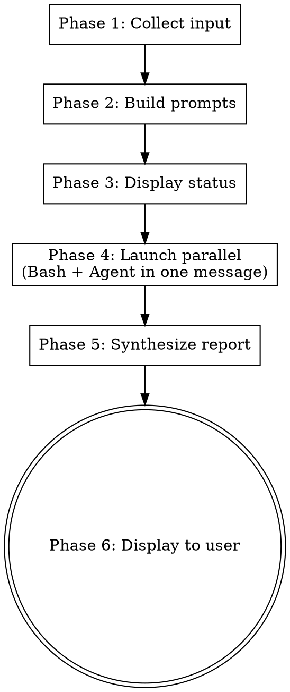

# Spec Review

## Overview

Dispatch parallel reviews of a spec / design document to Codex CLI (codebase-grounded) and a Claude Code Agent (codebase + web), then synthesize a 4-axis report in the terminal. Two AI perspectives on the same spec, combined into one coherent review.

**Prerequisite:** The `codex` CLI must be installed (`npm i -g @openai/codex`). If unavailable, fall back to Claude Code Agent results only.

## When to Use

- After `brainstorming` produces a spec and before invoking `writing-plans`, to get a second opinion
- When auditing an existing design document for technical correctness, simplification opportunities, or better tech choices
- When you want both codebase-grounded review (Codex) and web-aware review (Claude Code Agent + Web)

**When NOT to use:**
- For implementation code review — use `code-review-board` or `codex-review` instead
- For deep multi-round debate — use `design-board` or `discussion-board` instead
- To modify the spec — this skill is read-only; the user updates the spec manually based on findings

## The 4 Fixed Axes

Every review evaluates the spec along these four axes:

| # | Axis | Focus |
|---|------|-------|
| 1 | **技術的裏どり** (Feasibility & Correctness) | Are technical premises and claims correct? Feasibility, API behavior, overlooked constraints. |
| 2 | **アルゴリズム改善提案** (Algorithm Improvement) | Are there better algorithms (efficiency, correctness, simplicity)? Complexity, correctness. |
| 3 | **アーキテクチャ簡素化提案** (Architecture Simplification) | Can the same goal be achieved with fewer components / abstractions? YAGNI perspective. |
| 4 | **技術スタック提案** (Tech Stack Suggestion) | Is there a better library / framework / language feature for the job? |

Both Codex and the Claude Code Agent evaluate ALL four axes. Their evidence-gathering methods differ:
- **Codex**: reads the codebase to ground claims (`[code-verified]`)
- **Claude Code Agent**: uses Read/Grep/Glob + WebSearch/WebFetch (`[web-verified]`, `[code-verified]`)

Both may also tag findings as `[general-knowledge]` (technical knowledge without concrete evidence) or `[unverified]` (claim that could not be confirmed; state what evidence would be needed).

## Workflow



### Phase 1: Collect Input

Receive from skill arguments:
- **File paths** (one or more spec files)
- **Free text** (additional context, e.g., the original brainstorming question)
- Or both

If neither is provided, ask the user with `AskUserQuestion`:
> "レビュー対象の仕様書ファイルパスを教えてください（複数可）。"

Verify each provided path exists. If a path is missing, report the error and stop.

### Phase 2: Build Prompts

Build separate prompts for Codex and the Claude Code Agent. Both use the same 4-axis structure and the same output format. Only the evidence-gathering instructions differ.

**Shared output format (include in both prompts):**

```
Report your findings using EXACTLY this structure. If an axis has no findings, write "N/A".

## 1. 技術的裏どり (Feasibility & Correctness)
- Finding: <issue or confirmation>
- Evidence: [code-verified|web-verified|general-knowledge|unverified] <citation>
(repeat per finding)

## 2. アルゴリズム改善提案
- Suggestion: <proposed change>
- Rationale: <why>
- Trade-off: <what is lost>
(repeat per suggestion)

## 3. アーキテクチャ簡素化提案
- Suggestion: <proposed change>
- Rationale: <why>
- Trade-off: <what is lost>
(repeat per suggestion)

## 4. 技術スタック提案
- Current: <what the spec proposes>
- Alternative: <proposed replacement>
- Rationale: <why>
- Trade-off: <what is lost>
(repeat per suggestion)

## Confidence
High / Medium / Low — <reasoning>
```

**Codex prompt template:**

```
## Spec Files
{paths_one_per_line}

## Additional Context
{free_text or "N/A"}

## Instructions
You are reviewing the spec document(s) listed above. READ the files yourself (do not rely on inlined excerpts).

Evaluate the spec along these 4 fixed axes:
1. 技術的裏どり — verify technical premises against the codebase. Flag claims that contradict existing code, misuse APIs, or assume behavior that the codebase does not provide.
2. アルゴリズム改善提案 — propose more efficient / correct / simpler algorithms when applicable.
3. アーキテクチャ簡素化提案 — propose ways to reduce components or abstractions while preserving intent.
4. 技術スタック提案 — suggest better-suited libraries / frameworks / language features. Ground every suggestion in evidence (existing codebase patterns or well-known technical facts).

Evidence requirements:
- For each finding, cite the spec location (heading or quoted text) AND the supporting evidence (file:line for codebase, or label "[general-knowledge]" if no concrete evidence).
- Do NOT speculate. If a claim cannot be verified, mark the finding as [unverified] and state what evidence would be needed.

## Output Format
{shared_output_format}
```

**Claude Code Agent prompt template:**

```
## Spec Files
{paths_one_per_line}

## Additional Context
{free_text or "N/A"}

## Instructions
You are reviewing the spec document(s) listed above. Use Read to load the spec file(s). Then evaluate along these 4 fixed axes:
1. 技術的裏どり — verify technical premises. Use WebSearch/WebFetch to check current behavior of libraries/APIs/tools mentioned in the spec, especially when the spec relies on recent features or third-party services.
2. アルゴリズム改善提案 — propose more efficient / correct / simpler algorithms. Use Web for state-of-the-art references when applicable.
3. アーキテクチャ簡素化提案 — propose ways to reduce components or abstractions. Look for related implementations in the codebase via Read/Grep/Glob.
4. 技術スタック提案 — suggest better-suited libraries / frameworks / language features, including current ecosystem trends. Use WebSearch for recent (last 12 months) comparisons.

Evidence requirements:
- For each finding, cite the spec location AND the supporting evidence:
  - Codebase: file:line — tag [code-verified]
  - Web: URL — tag [web-verified]
  - Pure technical knowledge: tag [general-knowledge]
- Do NOT speculate. If a claim cannot be verified, mark [unverified].

## Output Format
{shared_output_format}
```

### Phase 3: Display Status

Before launching the parallel calls, display:

> "Codex と Claude Code Agent に並列で仕様書レビューを依頼しています（30〜90秒）..."

### Phase 4: Launch Parallel

Launch both tools in **a single message with two tool calls**. Sequential calls defeat the purpose of this skill.

**Tool call 1 — Bash (Codex):**

```bash
TMPFILE=$(mktemp /tmp/spec-review-codex-XXXXXX)
trap 'rm -f "$TMPFILE"' EXIT
cat <<'PROMPT_EOF' > "$TMPFILE"
{codex_prompt}
PROMPT_EOF
# --ephemeral: skip session persistence (skills never resume sessions)
# -m gpt-5.3-codex: coding-optimized model
cat "$TMPFILE" | codex exec --ephemeral -m gpt-5.3-codex
```

- Set Bash tool `timeout: 180000` (3 minutes).
- Never pass the prompt as a CLI argument — temp file + stdin only.

**Tool call 2 — Agent (Claude Code):**

```json
{
  "description": "spec-review Claude Code investigation",
  "subagent_type": "general-purpose",
  "prompt": "{agent_prompt}"
}
```

- The general-purpose agent has Read, Grep, Glob, WebSearch, WebFetch access.

**Both tool calls MUST be in the same message.**

**Codex unavailable fallback:** If `codex` returns exit 127, stderr contains "command not found", or the Bash call times out, proceed with Claude Code Agent results only. Note this at the top of the final report. (See Error Handling table for the full failure matrix.)

### Phase 5: Synthesize Report

After both results return (or one result + one error), build the unified report. Synthesize **per axis** — for each of the 4 axes, integrate both perspectives, then call out agreement / differences.

```markdown
## Spec Review Report: {spec_path}

{if Codex unavailable: "⚠ Codex未使用: {reason}"}
{if Agent unavailable: "⚠ Claude Code Agent未使用: {reason}"}

### Overall Assessment
{3-5 sentences: is the spec technically sound? Major concerns?}

### 1. 技術的裏どり (Feasibility & Correctness)
**Findings:**
- {finding} — Codex: {evidence}; Claude Code: {evidence}
{repeat per finding}

**Agreement:** {points where both reached the same conclusion}
**Differences:** {points found by only one side, or where perspectives differ}

### 2. アルゴリズム改善提案
{same structure}

### 3. アーキテクチャ簡素化提案
{same structure}

### 4. 技術スタック提案
{same structure}

### Confidence: High / Medium / Low
{reasoning based on agreement level and evidence strength}

---

レポートを確認し、必要に応じて仕様書を手動で更新してから `writing-plans` に進んでください。
```

**Confidence rubric:**

| Level | Criteria |
|-------|----------|
| **High** | Both sides agree on major points and provide concrete evidence ([code-verified] / [web-verified]) |
| **Medium** | Mostly agree with minor differences, or some evidence is [general-knowledge] |
| **Low** | Significant disagreement, weak evidence, or only one source available |

**Fallback cases:**
- If only one side returned results, still use the format above; note the missing source and set confidence to Low.
- If one side's output does not match the expected structure, include whatever was returned under the appropriate axis and note it was unstructured.
- If both fail, report the error to the user and stop.

### Phase 6: Display to User

Display the synthesized report in the terminal. Do NOT save to disk. Do NOT modify the spec file.

## Error Handling

| Situation | Action |
|-----------|--------|
| Codex CLI not installed (exit 127) or timeout | Report with Claude Code Agent results only. Add note: "⚠ Codex未使用: {reason}" at report top. |
| Agent failure | Report with Codex results only. Add note: "⚠ Claude Code Agent未使用: {reason}" at report top. |
| Both fail | Display error message and stop. |
| Partial / malformed output from either side | Best-effort integration; note which side was incomplete. |
| Spec file path does not exist | Report missing file to user and stop. |

## Quick Reference

| Step | Action |
|------|--------|
| Input | spec file paths (+ optional free text) |
| Prompts | 4 fixed axes, same output format for both, evidence-gathering differs |
| Launch | 1 message, 2 tool calls (Bash for Codex + Agent for Claude Code) |
| Output | Synthesized 4-axis report in terminal (no file save) |

## Common Mistakes

- **Not launching both tools in the same message** — sequential calls defeat parallelism.
- **Using wrong Codex subcommand** — must use `codex exec` for non-interactive mode; other invocations may hang.
- **Passing long prompts as CLI arguments** — always use temp file + stdin. Direct CLI args can exceed shell limits (~32KB on Windows) and cause Codex to hang silently.
- **Inlining full spec text into the prompt** — instead, list the file paths and let each tool `Read` the spec. Shorter prompts produce faster, more focused results.
- **Forgetting the Bash `timeout: 180000`** — the default 120s timeout will kill longer Codex runs.
- **Saving the report to disk or editing the spec** — this skill is display-only and read-only. The user manually edits the spec based on findings.
- **Evaluating fewer than 4 axes** — the 4 axes are fixed and required. If an axis has no findings, write `N/A`, do not omit the section.
