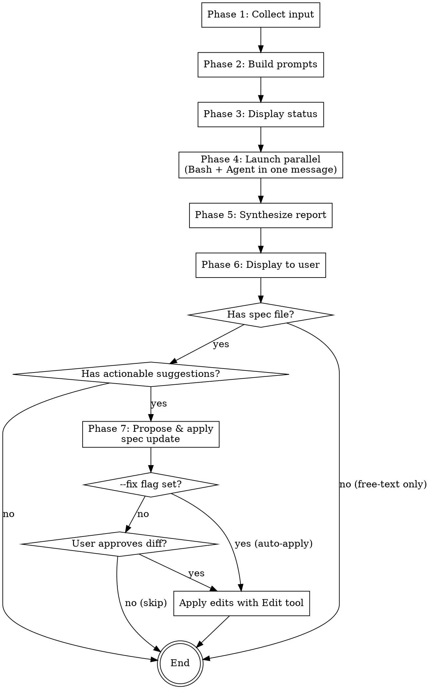

# Spec Review

## Overview

Dispatch parallel reviews of a spec / design document to Codex CLI (codebase-grounded) and a Claude Code Agent (codebase + web), synthesize a 4-axis report in the terminal, then optionally apply updates back to the spec file. Two AI perspectives on the same spec, combined into one coherent review with a single review-to-revision loop.

By default, spec updates are proposed and require user approval (Apply/Skip) before any edit. Pass the **`--fix`** flag in the skill arguments to auto-apply: the proposed diff is still displayed, but the approval gate is skipped and the edits are written to the spec file automatically.

**Prerequisite:** The `codex` CLI must be installed (`npm i -g @openai/codex`). If unavailable, fall back to Claude Code Agent results only.

## When to Use

- After `brainstorming` produces a spec and before invoking `writing-plans`, to get a second opinion
- When auditing an existing design document for technical correctness, simplification opportunities, or better tech choices
- When you want both codebase-grounded review (Codex) and web-aware review (Claude Code Agent + Web)

**When NOT to use:**
- For implementation code review — use `code-review-board` or `codex-review` instead
- For deep multi-round debate — use `design-board` or `discussion-board` instead

## The 4 Fixed Axes

Every review evaluates the spec along these four axes:

| # | Axis | Focus |
|---|------|-------|
| 1 | **Feasibility & Correctness** | Are technical premises and claims correct? Feasibility, API behavior, overlooked constraints. |
| 2 | **Algorithm Improvement** | Are there better algorithms (efficiency, correctness, simplicity)? Complexity, correctness. |
| 3 | **Architecture Simplification** | Can the same goal be achieved with fewer components / abstractions? YAGNI perspective. |
| 4 | **Tech Stack Suggestion** | Is there a better library / framework / language feature for the job? |

Both Codex and the Claude Code Agent evaluate ALL four axes. Their evidence-gathering methods differ:
- **Codex**: reads the codebase to ground claims (`[code-verified]`)
- **Claude Code Agent**: uses Read/Grep/Glob + WebSearch/WebFetch (`[web-verified]`, `[code-verified]`)

Both may also tag findings as `[general-knowledge]` (technical knowledge without concrete evidence) or `[unverified]` (claim that could not be confirmed; state what evidence would be needed).

## Workflow



### Phase 1: Collect Input

Receive from skill arguments:
- **`--fix` flag** (optional) — if present anywhere in the arguments, enable auto-apply mode for Phase 7 (skip the approval gate). Strip the `--fix` token from the arguments before parsing paths / free text so it is not mistaken for a file path. Record `fix_mode = true`.
- **File paths** (one or more spec files)
- **Free text** (additional context, e.g., the original brainstorming question)
- Or both

If neither a path nor free text is provided (after stripping `--fix`), ask the user with `AskUserQuestion`:
> "Please provide the path(s) to the spec file(s) to review (one or more)."

Verify each provided path exists. If a path is missing, report the error and stop.

### Phase 2: Build Prompts

Build separate prompts for Codex and the Claude Code Agent. Both use the same 4-axis structure and the same output format. Only the evidence-gathering instructions differ.

**Shared output format (include in both prompts):**

```
Report your findings using EXACTLY this structure. If an axis has no findings, write "N/A".

## 1. Feasibility & Correctness
- Finding: <issue or confirmation>
- Evidence: [code-verified|web-verified|general-knowledge|unverified] <citation>
(repeat per finding)

## 2. Algorithm Improvement
- Suggestion: <proposed change>
- Rationale: <why>
- Trade-off: <what is lost>
(repeat per suggestion)

## 3. Architecture Simplification
- Suggestion: <proposed change>
- Rationale: <why>
- Trade-off: <what is lost>
(repeat per suggestion)

## 4. Tech Stack Suggestion
- Current: <what the spec proposes>
- Alternative: <proposed replacement>
- Rationale: <why>
- Trade-off: <what is lost>
(repeat per suggestion)

## Confidence
High / Medium / Low — <reasoning>
```

**Codex prompt template:**

```
## Spec Files
{paths_one_per_line}

## Additional Context
{free_text or "N/A"}

## Instructions
You are reviewing the spec document(s) listed above. READ the files yourself (do not rely on inlined excerpts).

Evaluate the spec along these 4 fixed axes:
1. Feasibility & Correctness — verify technical premises against the codebase. Flag claims that contradict existing code, misuse APIs, or assume behavior that the codebase does not provide.
2. Algorithm Improvement — propose more efficient / correct / simpler algorithms when applicable.
3. Architecture Simplification — propose ways to reduce components or abstractions while preserving intent.
4. Tech Stack Suggestion — suggest better-suited libraries / frameworks / language features. Ground every suggestion in evidence (existing codebase patterns or well-known technical facts).

Evidence requirements:
- For each finding, cite the spec location (heading or quoted text) AND the supporting evidence (file:line for codebase, or label "[general-knowledge]" if no concrete evidence).
- Do NOT speculate. If a claim cannot be verified, mark the finding as [unverified] and state what evidence would be needed.

## Output Format
{shared_output_format}
```

**Claude Code Agent prompt template:**

```
## Spec Files
{paths_one_per_line}

## Additional Context
{free_text or "N/A"}

## Instructions
You are reviewing the spec document(s) listed above. Use Read to load the spec file(s). Then evaluate along these 4 fixed axes:
1. Feasibility & Correctness — verify technical premises. Use WebSearch/WebFetch to check current behavior of libraries/APIs/tools mentioned in the spec, especially when the spec relies on recent features or third-party services.
2. Algorithm Improvement — propose more efficient / correct / simpler algorithms. Use Web for state-of-the-art references when applicable.
3. Architecture Simplification — propose ways to reduce components or abstractions. Look for related implementations in the codebase via Read/Grep/Glob.
4. Tech Stack Suggestion — suggest better-suited libraries / frameworks / language features, including current ecosystem trends. Use WebSearch for recent (last 12 months) comparisons.

Evidence requirements:
- For each finding, cite the spec location AND the supporting evidence:
  - Codebase: file:line — tag [code-verified]
  - Web: URL — tag [web-verified]
  - Pure technical knowledge: tag [general-knowledge]
- Do NOT speculate. If a claim cannot be verified, mark [unverified].

## Output Format
{shared_output_format}
```

### Phase 3: Display Status

Before launching the parallel calls, display:

> "Requesting a parallel spec review from Codex and the Claude Code Agent (30–90 seconds)..."

### Phase 4: Launch Parallel

Launch both tools in **a single message with two tool calls**. Sequential calls defeat the purpose of this skill.

**Tool call 1 — Bash (Codex):**

```bash
TMPFILE=$(mktemp /tmp/spec-review-codex-XXXXXX)
trap 'rm -f "$TMPFILE"' EXIT
cat <<'PROMPT_EOF' > "$TMPFILE"
{codex_prompt}
PROMPT_EOF
# --ephemeral: skip session persistence (skills never resume sessions)
cat "$TMPFILE" | codex exec --ephemeral
```

- Set Bash tool `timeout: 180000` (3 minutes).
- Never pass the prompt as a CLI argument — temp file + stdin only.

**Tool call 2 — Agent (Claude Code):**

```json
{
  "description": "spec-review Claude Code investigation",
  "subagent_type": "general-purpose",
  "prompt": "{agent_prompt}"
}
```

- The general-purpose agent has Read, Grep, Glob, WebSearch, WebFetch access.

**Both tool calls MUST be in the same message.**

**Codex unavailable fallback:** If `codex` returns exit 127, stderr contains "command not found", or the Bash call times out, proceed with Claude Code Agent results only. Note this at the top of the final report. (See Error Handling table for the full failure matrix.)

### Phase 5: Synthesize Report

After both results return (or one result + one error), build the unified report. Synthesize **per axis** — for each of the 4 axes, integrate both perspectives, then call out agreement / differences.

```markdown
## Spec Review Report: {spec_path}

{if Codex unavailable: "⚠ Codex not used: {reason}"}
{if Agent unavailable: "⚠ Claude Code Agent not used: {reason}"}

### Overall Assessment
{3-5 sentences: is the spec technically sound? Major concerns?}

### 1. Feasibility & Correctness
**Findings:**
- {finding} — Codex: {evidence}; Claude Code: {evidence}
{repeat per finding}

**Agreement:** {points where both reached the same conclusion}
**Differences:** {points found by only one side, or where perspectives differ}

### 2. Algorithm Improvement
{same structure}

### 3. Architecture Simplification
{same structure}

### 4. Tech Stack Suggestion
{same structure}

### Confidence: High / Medium / Low
{reasoning based on agreement level and evidence strength}

---

Review the report, then decide whether to approve the spec updates proposed in Phase 7. After approval, proceeding to `writing-plans` is recommended.
```

**Confidence rubric:**

| Level | Criteria |
|-------|----------|
| **High** | Both sides agree on major points and provide concrete evidence ([code-verified] / [web-verified]) |
| **Medium** | Mostly agree with minor differences, or some evidence is [general-knowledge] |
| **Low** | Significant disagreement, weak evidence, or only one source available |

**Fallback cases:**
- If only one side returned results, still use the format above; note the missing source and set confidence to Low.
- If one side's output does not match the expected structure, include whatever was returned under the appropriate axis and note it was unstructured.
- If both fail, report the error to the user and stop.

### Phase 6: Display to User

Display the synthesized report in the terminal. Do NOT save the report to disk. (Spec file edits, if any, happen in Phase 7.) Proceed to Phase 7.

### Phase 7: Propose & Apply Spec Update

After the report is displayed, optionally apply the review's findings back to the spec file as edits.

- **Default mode** (`fix_mode = false`): edits are proposed and applied only after the user approves the diff (Step 7.3).
- **Auto-apply mode** (`fix_mode = true`, i.e. `--fix` was passed): the diff is still built and displayed (Steps 7.1–7.2), but the approval gate (Step 7.3) is skipped and the edits are applied automatically (Step 7.4).

The skip conditions and the finding filter (Steps 7.1) apply in BOTH modes — `--fix` only removes the human approval gate, it does not loosen which findings qualify as edits.

#### Skip conditions

Skip Phase 7 entirely (proceed to End) if any of the following holds:

- **No spec file path was provided** — the review ran on free text only; there is no file to edit.
- **No actionable suggestions** — after filtering (below), zero proposed edits remain. Tell the user: "No applicable concrete suggestions, so Phase 7 is skipped."
- **Multiple spec files** — if more than one path was provided, ask the user via `AskUserQuestion` which file to update, or skip if none.

#### Step 7.1: Filter findings into actionable edits

Walk through each section of the synthesized report. Keep a finding ONLY if all three hold:

1. **Concrete change** — the finding/suggestion describes a specific text change (not a vague concern like "consider performance").
2. **Locatable** — the target section in the spec is identifiable by heading or quoted text. Vague references ("the design overall") are rejected.
3. **Confidence is not Low** — only High / Medium findings are proposed by default. Low-confidence items may be presented separately if the user opts in.

Discard everything else. Findings that disagreed between Codex and the Claude Code Agent are kept ONLY when the disagreement was resolved during synthesis; unresolved conflicts are NOT proposed as edits.

#### Step 7.2: Build the proposed diff

For each kept finding, construct an edit entry:

```
### Edit {N} — {axis} — {short title}
**Location:** {heading path in spec, e.g., "## Specification > ### Phase 2"}
**Operation:** replace | insert-after | insert-before | delete
**Rationale:** {1 sentence pointing to the report finding}

```diff
- {original text from spec, if replace/delete}
+ {new text, if replace/insert}
```
```

Group entries by axis (Feasibility & Correctness → Algorithm Improvement → Architecture Simplification → Tech Stack Suggestion). Number them globally (Edit 1, Edit 2, ...).

Display the full diff block in the terminal before asking for approval.

#### Step 7.3: Ask for approval

**Auto-apply mode (`fix_mode = true`):** Skip this step entirely. Do NOT call `AskUserQuestion`. Print a one-line notice — "`--fix` set: auto-applying the {N} changes above to `{spec_path}`." — and proceed directly to Step 7.4.

**Default mode (`fix_mode = false`):** Use `AskUserQuestion`:

> "Apply the {N} changes above to `{spec_path}`?"
>
> Options:
> - **Apply** — Apply all {N} edits as shown.
> - **Skip** — Display the diff only; do not modify the spec.

(Per-edit selection is intentionally NOT offered to keep the loop simple. If the user wants partial application, they choose Skip and apply manually.)

#### Step 7.4: Apply

Apply when EITHER `fix_mode = true` (auto-apply) OR the user chose Apply in Step 7.3:

1. For each edit entry, use the `Edit` tool with `old_string` = original text (or empty for inserts) and `new_string` = new text. Set `replace_all: false` (each location should be unique; if `Edit` errors due to non-unique `old_string`, widen the `old_string` to include surrounding context and retry once).
2. After all edits succeed, report: "Applied {N} changes to `{spec_path}`."
3. If any edit fails after the retry, stop and report which edit failed with the error message. Do NOT roll back successful edits — leave the partially-updated state for the user to inspect. (This applies in auto-apply mode too — `--fix` never triggers a rollback.)

If the user chose Skip (default mode only), do nothing and end.

#### Step 7.5: End

Suggest next action:

> "After reviewing the spec, proceeding to `writing-plans` is recommended."

## Error Handling

| Situation | Action |
|-----------|--------|
| Codex CLI not installed (exit 127) or timeout | Report with Claude Code Agent results only. Add note: "⚠ Codex not used: {reason}" at report top. |
| Agent failure | Report with Codex results only. Add note: "⚠ Claude Code Agent not used: {reason}" at report top. |
| Both fail | Display error message and stop. |
| Partial / malformed output from either side | Best-effort integration; note which side was incomplete. |
| Spec file path does not exist | Report missing file to user and stop. |
| Phase 7 `Edit` fails after retry (e.g., `old_string` not unique or not found) | Stop Phase 7. Report which edit failed and the error. Do NOT roll back already-applied edits — leave partial state for inspection. |

## Quick Reference

| Step | Action |
|------|--------|
| Input | spec file paths (+ optional free text) (+ optional `--fix` flag) |
| Prompts | 4 fixed axes, same output format for both, evidence-gathering differs |
| Launch | 1 message, 2 tool calls (Bash for Codex + Agent for Claude Code) |
| Output | Synthesized 4-axis report in terminal (no file save) |
| Update (Phase 7) | Filter findings → propose diff → user approves Apply/Skip → `Edit` tool applies |
| Update with `--fix` | Filter findings → propose & display diff → **auto-apply** (no approval gate) → `Edit` tool applies |

## Common Mistakes

- **Not launching both tools in the same message** — sequential calls defeat parallelism.
- **Using wrong Codex subcommand** — must use `codex exec` for non-interactive mode; other invocations may hang.
- **Passing long prompts as CLI arguments** — always use temp file + stdin. Direct CLI args can exceed shell limits (~32KB on Windows) and cause Codex to hang silently.
- **Inlining full spec text into the prompt** — instead, list the file paths and let each tool `Read` the spec. Shorter prompts produce faster, more focused results.
- **Forgetting the Bash `timeout: 180000`** — the default 120s timeout will kill longer Codex runs.
- **Saving the report to disk** — the report stays in the terminal; only the spec file itself may be edited (Phase 7, with user approval).
- **Applying spec edits without showing the diff first** — Phase 7 MUST display the full diff before any `Edit` call, in BOTH modes. In default mode it then obtains `AskUserQuestion` approval; in auto-apply mode (`--fix`) it applies after displaying the diff. Never apply edits that were not shown to the user.
- **Treating `--fix` as a license to skip the filter or the diff** — `--fix` only removes the human approval gate (Step 7.3). The finding filter (Step 7.1) and the diff display (Step 7.2) still run. Do not auto-apply Low-confidence or vague findings.
- **Treating a path-like `--fix` as a file** — `--fix` is a flag, not a spec path. Strip it during Phase 1 input parsing before verifying file paths exist.
- **Proposing edits for vague or Low-confidence findings** — Phase 7 filter keeps only concrete, locatable, non-Low-confidence findings. Skipping the filter floods the user with noise.
- **Rolling back on Phase 7 failure** — if one `Edit` fails mid-application, leave the partial state for the user to inspect. Silent rollback hides what was already applied.
- **Evaluating fewer than 4 axes** — the 4 axes are fixed and required. If an axis has no findings, write `N/A`, do not omit the section.
